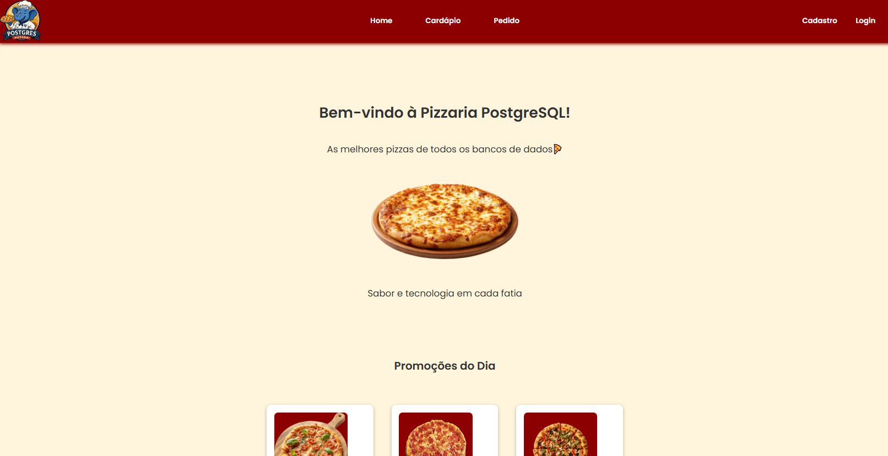
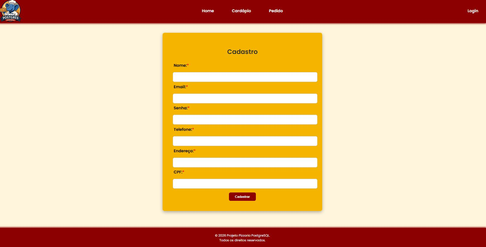
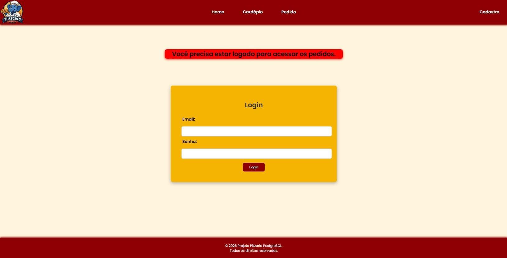
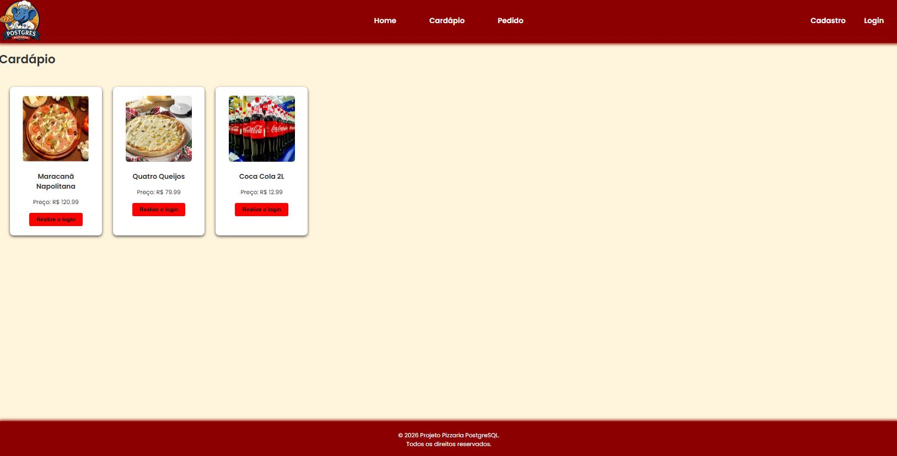
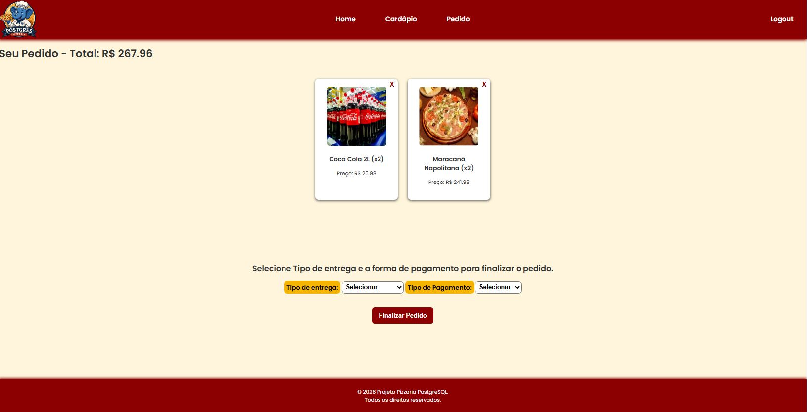
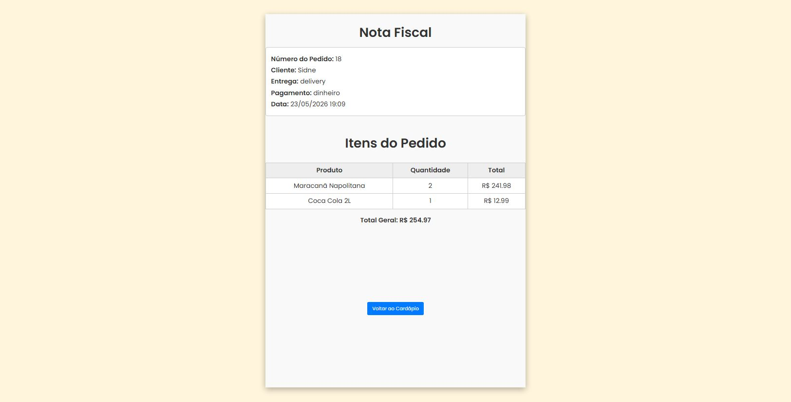

<p align="center">
  
</p>

<h1 align="center">🍕 Sistema de Pizzaria - Full Stack (Flask + PostgreSQL)</h1>

<p align="center">
  Aplicação web de pizzaria desenvolvida em Flask (Python) com PostgreSQL, HTML e CSS, criada para praticar conceitos de desenvolvimento full stack, modelagem de banco de dados e organização de projetos.
</p>

## 📸 Screenshots

| Página Inicial | Cadastro |
|----------------|----------|
|  |  |

| Login | Cardápio |
|-------|----------|
|  |  |

| Pedido | Nota Fiscal |
|--------|-------------|
|  |  |

## 💻 Ferramentas e Tecnologias

[](https://skillicons.dev)
- **[PostgreSQL](https://www.postgresql.org/docs/18/index.htmlL)**  
- **[Flask](https://flask.palletsprojects.com/en/stable/quickstart/)**  
- **[HTML](https://www.w3schools.com/Html/)**  
- **[CSS](https://www.w3schools.com/css/default.asp)**  
- **[Python](https://www.w3schools.com/python/default.asp)** 
- **[Git](https://www.w3schools.com/git/default.asp?remote=github)**
- **[Visual Studio Code](https://code.visualstudio.com/docs)**

## 🎯 Funcionalidades

- ✅ Cadastro de usuários  
- ✅ Login  
- ✅ Exibição de cardápio com imagens  
- ✅ Realização de pedidos  
- ✅ Finalização de pedidos com nota fiscal  
- ✅ Regras de negócio aplicadas no banco (restrições, integridade, validações)  
- ✅ Mensagens de feedback ao usuário  

## 🧠 Conceitos aplicados

- **[Criação de tabelas](https://www.w3schools.com/sql/sql_create_table.asp)** com `CREATE TABLE`
- **[Chave primária](https://www.w3schools.com/sql/sql_primarykey.asp)** (`PRIMARY KEY`, `FOREIGN KEY`)
- **[Chave estrangeira](https://www.w3schools.com/sql/sql_foreignkey.asp)** (`FOREIGN KEY`)
- **[Regras de integridade](https://www.bosontreinamentos.com.br/mysql/opcoes-de-chave-estrangeira-mysql/)** com `ON DELETE` (`RESTRICT`, `CASCADE`)
- **[Validações](https://www.tutorialspoint.com/sql/sql-check-constraint.htm)** com `CHECK`
- **[Restrições de unicidade](https://www.w3schools.com/sql/sql_unique.asp)** com `UNIQUE`
- Tipos de dados adequados (`VARCHAR`, `CHAR`, `NUMERIC`, `TIMESTAMP`)

## 🗂️ Estrutura do Banco

O sistema foi modelado com as seguintes entidades:

* **usuarios** → Armazena dados dos clientes
* **pedidos** → Representa os pedidos realizados
* **produtos** → Lista de produtos disponíveis
* **itens_pedido** → Relaciona pedidos e produtos (itens do pedido)

## 🔗 Relacionamentos

* Um usuário pode ter vários pedidos
* Um pedido pertence a um único usuário
* Um pedido pode conter vários produtos
* Produtos não podem ser removidos se já estiverem vinculados a pedidos
* Ao excluir um pedido, seus itens são removidos automaticamente

## ⚙️ Regras de negócio implementadas

* Não é possível excluir usuários que possuem pedidos (`ON DELETE RESTRICT`)
* Ao excluir um pedido, seus itens são excluídos automaticamente (`ON DELETE CASCADE`)
* Produtos não podem ser excluídos se estiverem em pedidos (`ON DELETE RESTRICT`)
* Não é permitido repetir o mesmo produto dentro de um pedido (`UNIQUE (pedido_id, produto_id)`)
* Quantidade de itens deve ser maior que zero
* Preço dos produtos não pode ser negativo

## 🌐 Interface do sistema (Frontend)

O projeto também conta com páginas iniciais desenvolvidas em HTML e CSS:

* Criado **Index.html** como página inicial com mensagem de boas-vindas e promoções do dia
* Criado **Cadastro.html** para registro de usuários com campos de nome, email, senha, telefone, endereço e CPF
* Criado **Login.html** para autenticação de usuários com campos de nome e senha
* Criado **Cardapio.html** para exibição do cardápio com links de navegação
* Criado **Pedido.html** para realização de pedidos com links de navegação
* Criado  **Nota_fiscal.html** → Exibição da nota fiscal com itens e totais
* Adicionada **PizzariaLogo.png** como logotipo do projeto
* Incluídos arquivos CSS para estilização das páginas

## 🚀 Backend com Python/Flask

- Rotas limpas (`/`, `/cardapio`, `/pedido`, etc.)  
- Templates renderizados com `render_template()`  
- Arquivos estáticos servidos via `url_for('static', filename='...')`  
- Organização da pasta `static/` em `css/` e `img/`  
- Navbar com navegação consistente  
- Modularização com **Blueprints**  
- Sistema de login e logout  
- Mensagens de feedback (ex: *Cadastro realizado com sucesso!*)  
- Restrição de pedidos sem login (redireciona para login com aviso) 

### 📂 Estrutura do Projeto

    pizzariapostgresql/
    │
    ├── app.py               # Inicialização do Flask
    ├── routes/              # Rotas separadas (home, cardápio, pedido, login, cadastro)
    ├── templates/           # Páginas HTML
    ├── static/
    │   ├── css/             # Estilos
    │   ├── img/             # Logo e imagens
    │   ├── img/cardapio/    # Imagens do cardápio
    │   └── js/              # Script simples
    └── database/
        ├── db.py            # Conexão PostgreSQL
        ├── schema.sql       # Estrutura do banco
        ├── seed.sql         # Dados iniciais
        └── queries.sql      # Ajustes durante a criação 

## ▶️ Como usar

1. **Clone o repositório**
   ```bash
   git clone https://github.com/SDinee/PizzariaPostgreSQL

2. **Crie e ative um ambiente virtual (opcional, mas recomendado)**
    ```bash
    # criar ambiente virtual
    python -m venv venv

    # ativar no Linux/Mac
    source venv/bin/activate

    # ativar no Windows
    venv\Scripts\activate

3. **Instale as dependências**
    ```bash
    ## Esse comando vai baixar e instalar Flask (framework web) e psycopg2 (driver PostgreSQL) de uma vez só no ambiente ativo
    pip install flask psycopg2

    ## Se estiver no Windows e der erro com psycopg2, usa:
    pip install psycopg2-binary

4. **Conectar Banco**
    ```bash
    ## você também precisa ter o PostgreSQL instalado na sua máquina, porque o psycopg2 é só o driver que faz a ponte entre o Python e o banco.
    Após PostgresSQL instalado abrir e executar os itens dentro do database **(Schema e Seed)**

    ## Ir na pasta database alterar os valores dentro de db.py para os que você escolheu em seu postgres, Se está utilizando tudo padrão só alterar a senha.

5. **Iniciar**
    ```bash
    ## Após todos os passos só iniciar app.py
    python app.py

## 📌 Observações

Este projeto tem fins educacionais e foi desenvolvido como parte do meu processo de aprendizado em Análise e Desenvolvimento de Sistemas.

## 👨‍💻 Autor

Sidne
